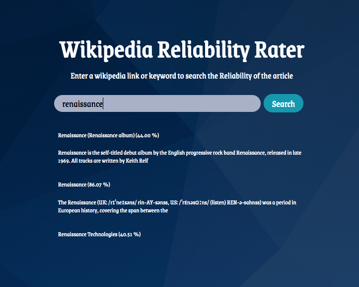

# Wikipedia Reliability Rater (WiRR)
<!-- <a href="https://www.mongodb.com/"></a>
<a href="#"></a>
<a href="#"></a>
<a href="https://github.com"></a> -->

[WiRR Live](http://www.wikipediarr.com/)

## Background and Overview
WiRR is an application to help determine the reliability of a given Wikipedia article. The reliability of the article is determined by our custom made reliability index. The reliability index is determined mainly by citations. The citations have the following scoring:

  | Domain / Source        | Score         |
  |:-----------------------|:--------------|
  | text/scholarly article | 5             |
  | `.edu` / `.gov`        | 4             |
  | `.org`                 | 3             |
  | `.com` / `.net`        | 1             |

This would then be divided by the maximum total score and multiplied by 100 to get a percentage.

## Technologies
#### Stack
- Backend
  - Node
  - Express
  - MongoDB
- Frontend
  - React
  - Redux
#### Noticable Dependencies
- bcrypjs
  - Use: Hash passwords before they get stored in database
- uuid
  - Use: 
- cheerio
  - Use: Scrape inforamtion from certain web pages
- Request
  - Use: Go to a certain webpage
- D3
  - Use: Display data from charts
#### APIs
- [Wikimdeia API](https://www.mediawiki.org/wiki/API:Main_page)
  - Uses: 
    - Search functionality
    - Get total lifetime contributions of certain authors

## Setup
1. Create file called `key_dev.js` under `./config` directory
   - And place code snippet with following format into your file:
   ```javaScript
    module.exports = {
      "mongoURI": "YOUR MONGO URI KEY HERE",
      "secretOrKey": "YOUR SECRET OR KEY HERE"
    }
   ```
2. `npm install` in root directory to install root dependencies
3. `npm install` in `./client` to install frontend dependencies
4. `npm run dev` to run both server and webpack
5. Open http://localhost:3000/

## How to use
1. Go to [WiRR](http://www.wikipediarr.com/)


2. Search for the article you are interested in



3. Analyze result and measure how reliable this article is


  - Things to look at:
    - Last updated date
      - Is it new? Is it old?
    - Citation source distribution
      - Articles that have a majority of text citations are considered reliable in our measures
    - Author activity
      - Is this article mainly written by one author (observe donut chart)? If so, how many lifetime contributions do they have (observe bar chart)?
      
## Noticeable Features
#### Interactive User Auth Errors


Done through `express-validator` and `gravatar` dependencies:
```JavaScript
router.post(
  '/register',
  [
    check('name', 'Name is required').not().isEmpty(),
    check('email', 'A valid email is required').isEmail(),
    check('password', 'A password of 6 or more characters is required').isLength({ min: 6 })
  ],
  async (req, res) => {
    const errors = validationResult(req);

    if (!errors.isEmpty()) {
      return res.status(400).json({ errors: errors.array() });
    }

    const { name, email, password } = req.body;

    try {
      let user = await User.findOne({ email });

      if (user) {
        return res.status(400).json({ errors: [{msg: 'User already exists!' }]});
      }

      const avatar = gravatar.url(email, {
        s: '200',
        r: 'pg',
        d: 'mm'
      });
      // ...
      // There is more code, but this is what mainly displays the errors
    }
  }
)
```
Rest of code can be found in `routes/api/register.js`


--- 
#### Dynamic Search


Done through Wikimedia API: 
```javaScript
searchWiki() {
  let apiUrl = "https://en.wikipedia.org/w/api.php?origin=*";
  let searchParams = {
    action: "query",
    format: "json",
    list: "search|users",
    srlimit: 10, // how many articles to return
    prop: "info|contributors|revisions",
    ususerids: "",
    inprop: "url",
    srsearch: this.state.search_text
  }

  Object.keys(searchParams).forEach((key) => {
    apiUrl += "&" + key + "=" + searchParams[key];
  });

  fetch(apiUrl)
    .then((response) => { return response.json(); })
    // ...
    // There is more code that parses and displays result from JSON object
}
```

Rest of code can be found in `client/src/components/search/search.jsx`

---
#### D3 Graphs


Both of the charts were drawn using [D3](https://d3js.org) JS (JavaScript) dependency.

Data for __donut__ __chart__ is gathered using a combination of web scraping (through [cheerio](https://cheerio.js.org/) JS dependency) and web crawling (through [request](https://www.npmjs.com/package/request) JS dependency). 

On other hand, data for __bar__ __chart__ is mostly gained through Wikimedia API. That is where we searched for each of top 10 authors by username, and collected lifetime contribution.

Let us take a look at skeleton of donut chart as an example:
```JavaScript
d3.select("#donut_graph_div").html("")
const radius = Math.min(this.state.width, this.state.height) / 2 - this.state.margin
let svg = d3.select("#donut_graph_div")
    .append("svg")
    .attr('class', 'article-show-donut-graph')
    .attr("width", this.state.width)
    .attr("height", this.state.height)
    .append("g")
    .attr("transform", "translate(" + this.state.width / 2 + "," + this.state.height / 2 + ")")

let color = d3.scaleOrdinal()
    .domain(this.state.data)
    .range(["violet", "indigo", "skyblue", "blue", "green", "lightgreen", "yellow", "orange", "red", "lightred", "lightBlue"])

let pie = d3.pie().value(function (d) { return d.value })
let data_ready = pie(d3.entries(this.state.data))

svg.selectAll('path')
    .attr('class', 'donut-graph-svg')
    .data(data_ready)
    .enter()
    .append('path')
    .attr('d', d3.arc()
        .innerRadius(70)
        .outerRadius(radius)
    )
    .attr('fill', function (d) { return (color(d.data.key)) })
    .attr('stroke', 'ghostwhite')
    .style('stroke-width', '1px')
    .attr('opacity', 1)
    .attr("transform", "translate(" + -this.state.width / 9 + "," + -this.state.height / 100 + ")")
```

This sample would draw donut chart without mouseover effect and legend. Including those requires more code, which can be found in `client/src/components/article/charts/donut_graph.jsx`


## Future Features
  - Ability for user to save favorite articles
  - Integration of author lifetime contributions into reliability score
    - If author with high number of lifetime contributions has written a significant portion of article, then article becomes more reliable.
